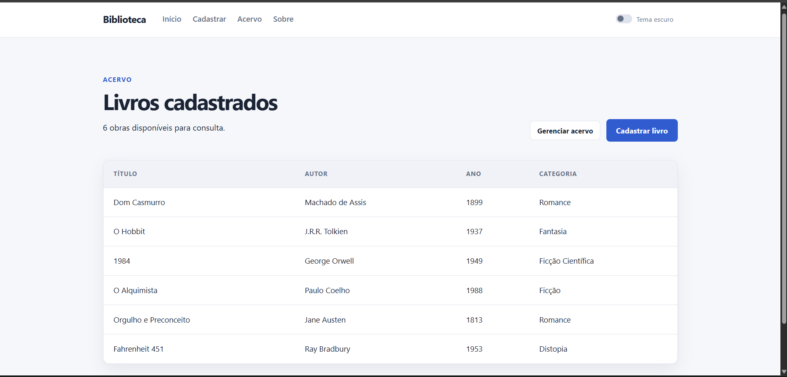
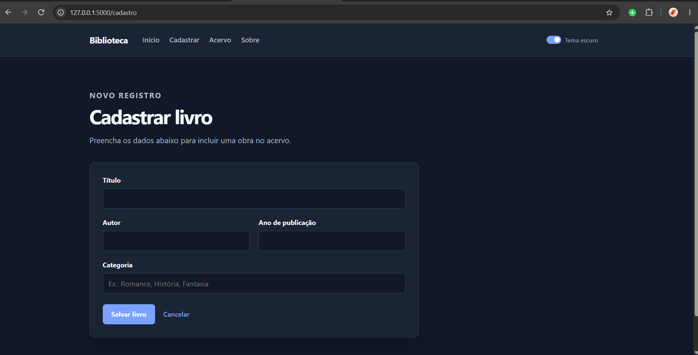
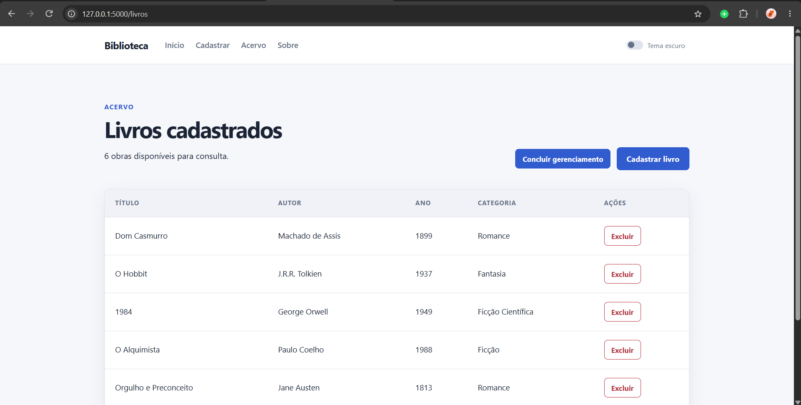
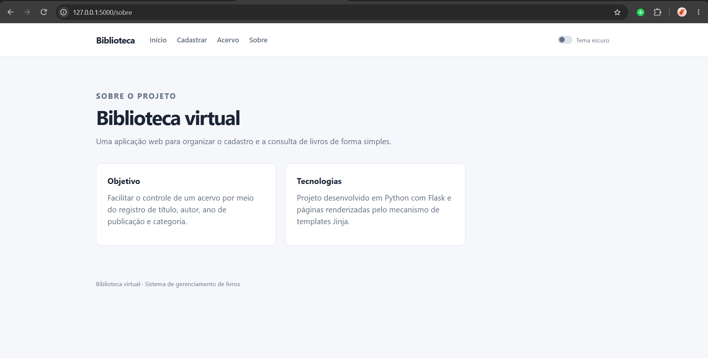

# Cadastro de Livros

Aplicação web para cadastrar e consultar livros de uma biblioteca virtual. O sistema permite registrar título, autor, ano de publicação e categoria, consultar o acervo e excluir registros quando necessário.

## Recursos

- Cadastro de livros com validação dos campos
- Listagem completa do acervo
- Exclusão de registros com controle de gerenciamento e confirmação
- Tema claro e escuro com preferência salva no navegador
- Layout responsivo para computador e celular

## Tecnologias

- Python
- Flask
- Jinja2
- HTML, CSS e JavaScript

## Como executar

1. Clone o repositório ou baixe os arquivos do projeto.
2. Abra um terminal na pasta do projeto.
3. Crie e ative um ambiente virtual:

```powershell
python -m venv venv
.\venv\Scripts\Activate.ps1
```

4. Instale as dependências:

```powershell
pip install -r requirements.txt
```

5. Inicie a aplicação:

```powershell
python app.py
```

6. Acesse `http://127.0.0.1:5000` no navegador.

## Imagens do projeto







## Observação

Os dados são mantidos temporariamente em memória. Ao reiniciar a aplicação, os livros cadastrados durante a execução são removidos.
